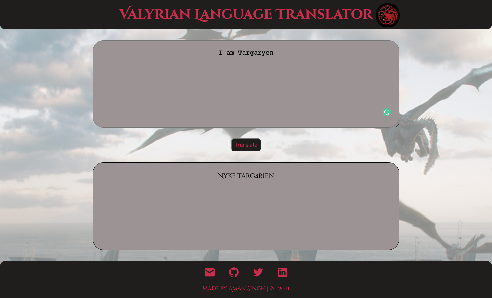

# Valyrian Language Translator
If you are a GOT fan then this WebApp is for you. It is a traslator WebApp which translate English language to Valyrian language. Built in VanillaJS, HTML & CSS.

---
## Technologies used
- HTML
- CSS
- JavaScript

---
## Preview

---

## Contact

- [Portfolio](https://amansingh.netlify.app "Aman's Portfolio")
- <a href="mailto: reachout.amansingh@gmail.com">Mail</a>
- [Twitter](https://twitter.com/aman11s "Aman's Twitter")
- [LinkedIn](https://linkedin.com/in/aman11s "Aman's LinkedIn")

---

### Live Project Link : [Click Here](https://valyrian-lang-translator.netlify.app "Valyrian Translator")

---

### If you like this repository please give a ⭐ in the top right corner. 😊

